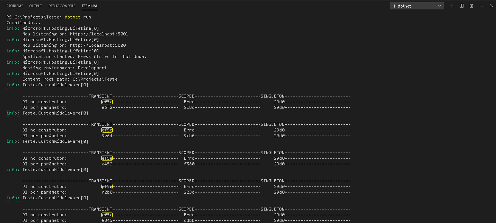
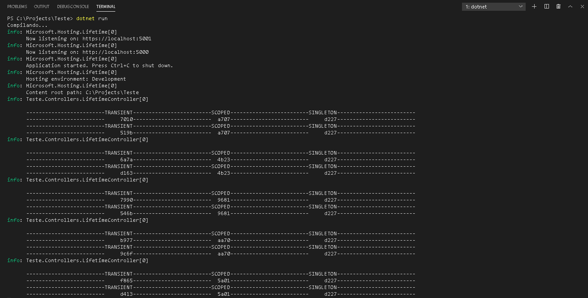

# ASP.NET-ServiceLifetimes
Projeto criado baseado no template Web API do ASP.NET 5, com o objetivo de analisar os diferentes *lifetimes*.
  1. Transient
  1. Scoped
  1. Singleton

Para demonstrar as diferenças, foram implementadas três interfaces específicas para cada *lifetime* (IOperationTransient, IOperationScoped e IOperationSingleton) representando uma operação com uma propriedade OperationId. Dependendo de qual interface foi injetada, o container de serviços proverá a mesma ou diferentes instâncias da operação.

## Cenário 1 - DI no middleware
> **Nota:** Para injetar um serviço scoped no middleware não utilize a injeção no construtor, isso gerará uma exceção em tempo de execução pois forçará o serviço scoped a se comportar como um serviço singleton. Para resolver isso, injete o serviço como parâmetro nos métodos *Invoke* ou *InvokeAsync* do middleware.

### Resultado
#### *Lifetime Transient*
- Ao injetar o serviço pelo construtor não obtive o resultado esperado, conforme a imagem acima, estão circulados em amarelo os valores de cada requisição. Esperava-se uma instância diferente a cada requisição, no entanto a instância permaneceu a mesma nas cinco requisições simulando um lifetime *singleton*.
- Ao injetar o serviço por parâmetro no middleware obtive o resultado esperado, a cada nova injeção de dependência cria-se uma nova instância do serviço.
 
#### *Lifetime Scoped*
- Ao injetar o serviço pelo construtor uma exceção em tempo de execução é gerada.
- Ao injetar o serviço por parâmetro no middleware obtive o resultado esperado, a cada requisição cria-se uma instância do serviço que permanece viva durante toda a solicitação independente de ter novas injeções de dependência do serviço em questão.

#### *Lifetime Singleton*
- Obtive o resultado esperado. Independente da injeção de dependência ser feita pelo construtor ou por parâmetro no middleware, ao injetar o serviço, seu lifetime permanece o mesmo duranto todo o tempo de vida da aplicação.

## Cenário 2 - DI no construtor do controller

### Resultado
#### *Lifetime Transient*
- A cada vez que o serviço é injetado, cria-se uma nova instância.

#### *Lifetime Scoped*
- Independente do serviço ser injetado mais de uma vez dentro de uma mesma requisição, a instância permanece a mesma. Porém entre uma requisição e outra a instância do serviço é renovada.

#### *Lifetime Singleton*
- A partir do momento em que um serviço for injetado, a instância permanecerá a mesma enquanto a aplicação estiver em execução.

## Referências
- [Dependency Injection (overview)](https://docs.microsoft.com/en-us/dotnet/core/extensions/dependency-injection#service-lifetimes)
- [Dependency Injection (services)](https://docs.microsoft.com/en-us/aspnet/core/fundamentals/dependency-injection?view=aspnetcore-5.0)
- [Dependency Injection - controllers](https://docs.microsoft.com/en-us/aspnet/core/mvc/controllers/dependency-injection?view=aspnetcore-5.0#constructor-injection)
- [Write middleware](https://docs.microsoft.com/en-us/aspnet/core/fundamentals/middleware/write?view=aspnetcore-5.0#per-request-middleware-dependencies)
